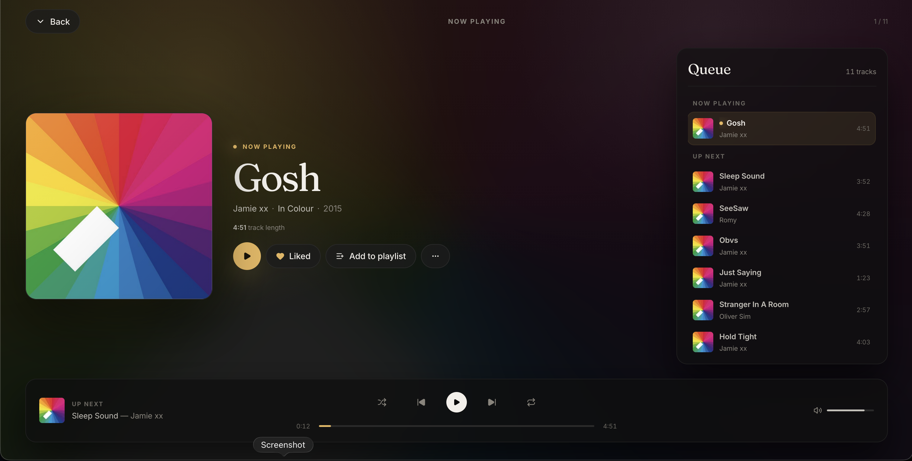

# Crosswalk

A web client for [Navidrome](https://www.navidrome.org/) (and any Subsonic-compatible music servers). Early development A _lot_ of this is unfinished., stay tunned, stay tunned.



## Requirements

- A browser
- Node.js 20+
- A running Navidrome (or Subsonic-compatible server) instance (barebones example provided in the [composer file](./docker-compose.yml))

## Setup

A `docker-compose.yml` is included to spin up a local Navidrome instance backed by the `data/` directory:

```sh
docker compose up -d
```

Navidrome will be available at `http://localhost:4533`. Update `user:` in `docker-compose.yml` if your UID/GID differs from `1000:1000`.

Run `npm run dev` and Crosswalk will be running at [http://localhost:5173/].

## License

GNU Affero General Public License v3.0 or later — see [LICENSE](LICENSE).
